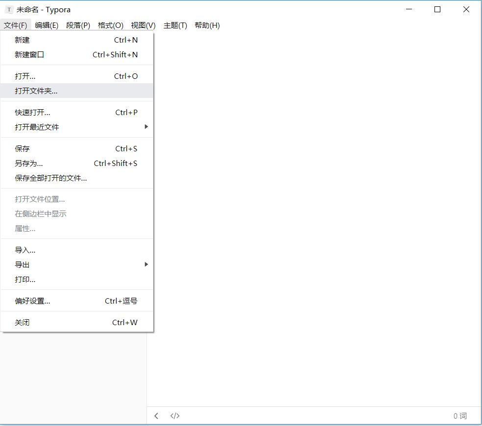
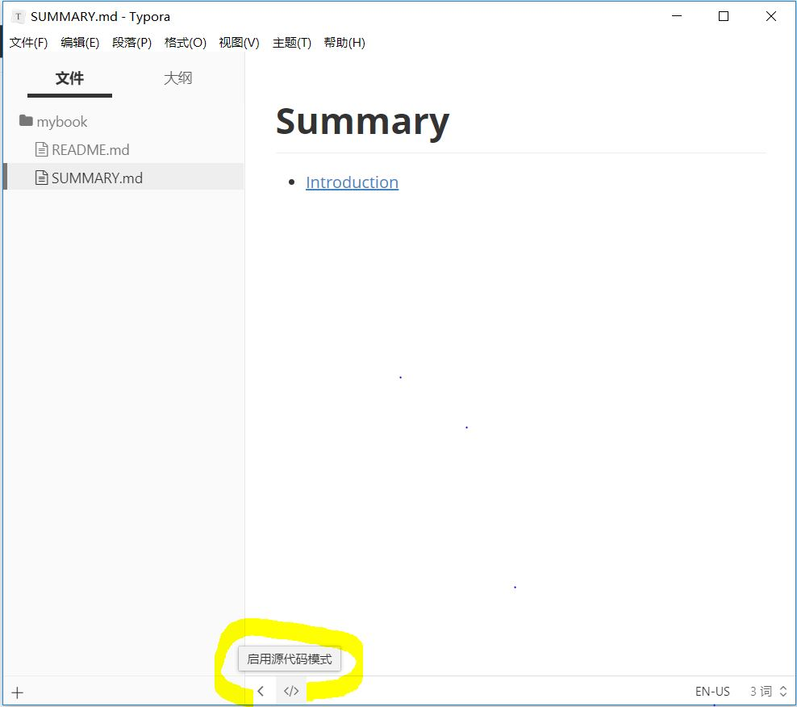

# 第三节 安装Typora

### 一、妙啊

Typora 是一款**支持实时预览的 Markdown 文本编辑器**。它有 OS X、Windows、Linux 三个平台的版本，并且由于仍在测试中，是**完全免费**的。

*功能强大、设计冷静、体验美妙、理念先进*

---
> **妙不可言，当你熟悉她，你会爱上她。**
---

[Typora 完全使用详解](https://sspai.com/post/54912)

[让 Markdown 写作更简单，免费极简编辑器：Typora](https://sspai.com/post/30292)

### 二、安装Typora

#### 1、下载安装

[Typora下载传送门](https://typora.io/#windows)

直接下载安装，打开软件 ===>>> 文件===>>>打开文件夹将之前3.1中新建的mybook打开。里面已经有两个文件。markdown格式，开始编辑。



#### 2、新建目录

**第一步：**在下面切换源码编辑如图：修改SUMMARY.md



**第二步：**修改目录内容：Typora 是所见即所得（实时渲染）的 Markdown 编辑器。会显示网页样式。

> 一定要记得保存 `Ctrl`+`S`！

```markdown
# 目录

* [前言](README.md)
* [第一章](Chapter1/README.md)
  * [第1节：衣](Chapter1/衣.md)
  * [第2节：食](Chapter1/食.md)
  * [第3节：住](Chapter1/住.md)
  * [第4节：行](Chapter1/行.md)
* [第二章](Chapter2/README.md)
* [第三章](Chapter3/README.md)
* [第四章](Chapter4/README.md)
———
```

很多时候我们并不需要一次性写完目录，随写随增。

但是目录结构要清晰。

**第三步：**回到命令行在mybook文件路径下`gitbook init`命令。GitBook会查找SUMMARY.md文件中描述的目录和文件，如果没有则创建。

```cmd
E:\06GitBook\mybook>gitbook init
info: create Chapter1/README.md
info: create Chapter1/衣.md
info: create Chapter1/食.md
info: create Chapter1/住.md
info: create Chapter1/行.md
info: create Chapter2/README.md
info: create Chapter3/README.md
info: create Chapter4/README.md
info: create SUMMARY.md
info: initialization is finished
```

#### 3、预览效果

**第四步：**执行`gitbook serve`来预览这本书籍。执行命令后会对 Markdown 格式的文档进行转换，默认转换为 html 格式，最后提示 “Serving book on [http://localhost:4000](http://localhost:4000/)”。

**第五步：**打开 [http://localhost:4000](http://localhost:4000/)浏览这本书。

至此关于电子书的制作基本完成了。下面是对书进行输出

serve命令可以指定端口：
```
gitbook serve --port 2333
```
---

#### 4、输出书籍

**第一种：静态网站**

```cmd
gitbook build [书籍路径] [输出路径]
```

默认将生成的静态网站输出到 _book 目录HTML文件。

**第二种：生成PDF格式**
```cmd
gitbook pdf ./ ./mybook.pdf
```

**第三种：生成epub格式**

```cmd
gitbook epub ./ ./mybook.epub 
```

**第四种：生成mobi格式**

```cmd
gitbook mobi ./ ./mybook.mobi
```

**第五种：用Git做版本管理**

```cmd
git init
git remote add...
git add
git commit -m 
git push
```

