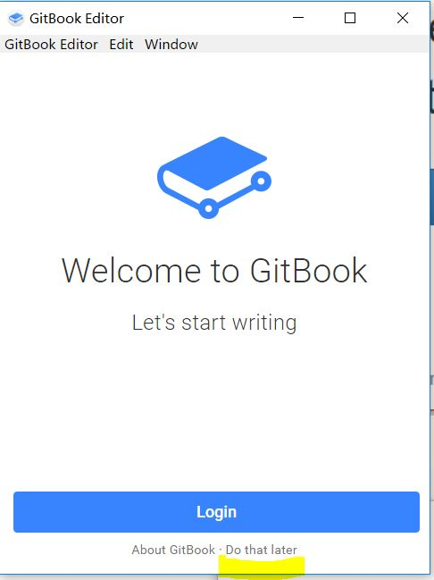

# 第四节 安装GitBook Editor

官网地址：[gitbook editor windows版](https://www.gitbook.com/editor/)长期处于更新中，国内访问不便利。

备用下载链接：https://pan.baidu.com/s/1nX6FRtyzvdNXj8ijaVIfng 提取码：3b7w 

直接运行.exe文件，安装：

Do that later：注册不易。网站更新中。。。

打开之后内部编辑。我还是喜欢Sublime和Typora。